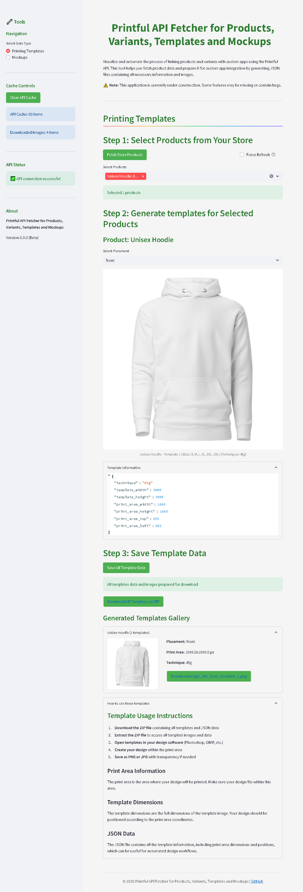

# Printful API Fetcher for Products, Variants, Templates and Mockups

A tool to fetch print templates and product mockups from the Printful API for your Printful store products.

## Features

- **Template Fetching**: Fetch and download print templates for your Printful products
- **Mockup Fetching**: Fetch product mockups from the Printful API
- **Product Management**: Easily select and manage products from your Printful store
- **API Integration**: Direct integration with the Printful API
- **Caching**: Efficient caching to reduce API calls and improve performance


*The Printful API Fetcher interface showing the template generation process for a hoodie product*

## Installation

1. Clone this repository:
```bash
git clone https://github.com/achortex/Printful_API_Fetcher
```

## Requirements

- Python 3.7+
- Streamlit
- Requests
- A valid Printful API key

## Installation

```bash
pip install -r requirements.txt
```

## Usage

```bash
streamlit run app.py
```

## Project Structure

```
├── app.py                  # Main application entry point
├── config.py               # Configuration settings
├── requirements.txt        # Project dependencies
├── README.md               # This file
├── src/
│   ├── api/                # API interaction modules
│   │   ├── __init__.py
│   │   └── printful.py     # Printful API client
│   ├── ui/                 # UI components
│   │   ├── __init__.py
│   │   ├── common.py       # Shared UI elements
│   │   ├── mockup.py       # Mockup generation UI
│   │   └── template.py     # Template generation UI
│   └── utils/              # Utility functions
│       ├── __init__.py
│       ├── file.py         # File handling utilities
│       └── image.py        # Image processing utilities
└── public/                 # Public assets directory
    ├── mockups/            # Generated mockups
    └── templates/          # Generated templates
```

## Personal Use Case

This tool was created for personal use while working on a separate project to simplify the process of implementing Printful's print-on-demand system into a web application. It helps streamline the workflow of fetching and managing print templates and product mockups, which can be time-consuming when done manually through the Printful dashboard.

By automating these processes, it significantly reduces the development time needed to integrate Printful's services into custom web applications. This is not an official Printful tool but a personal utility that others might find useful for similar integration projects.
